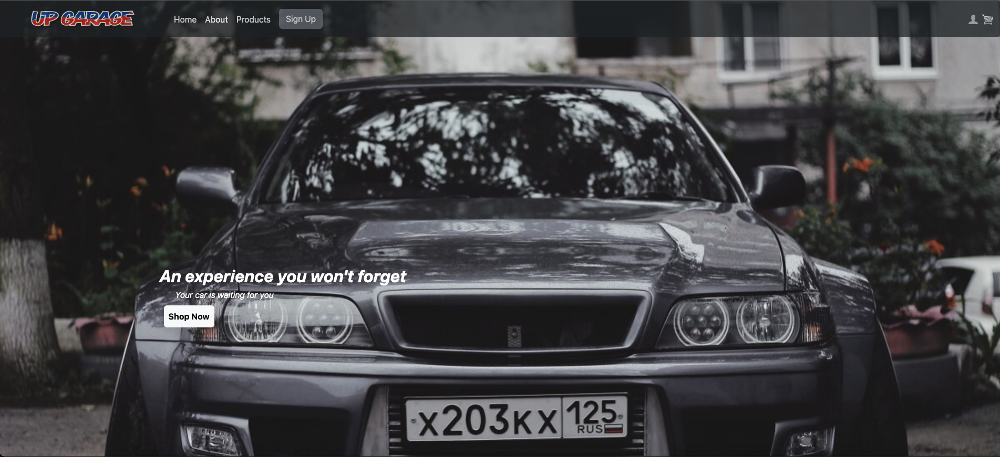
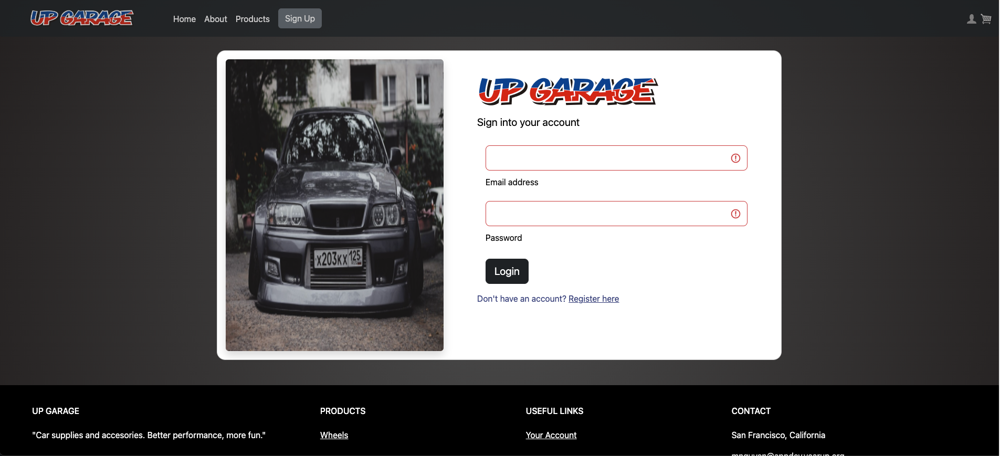
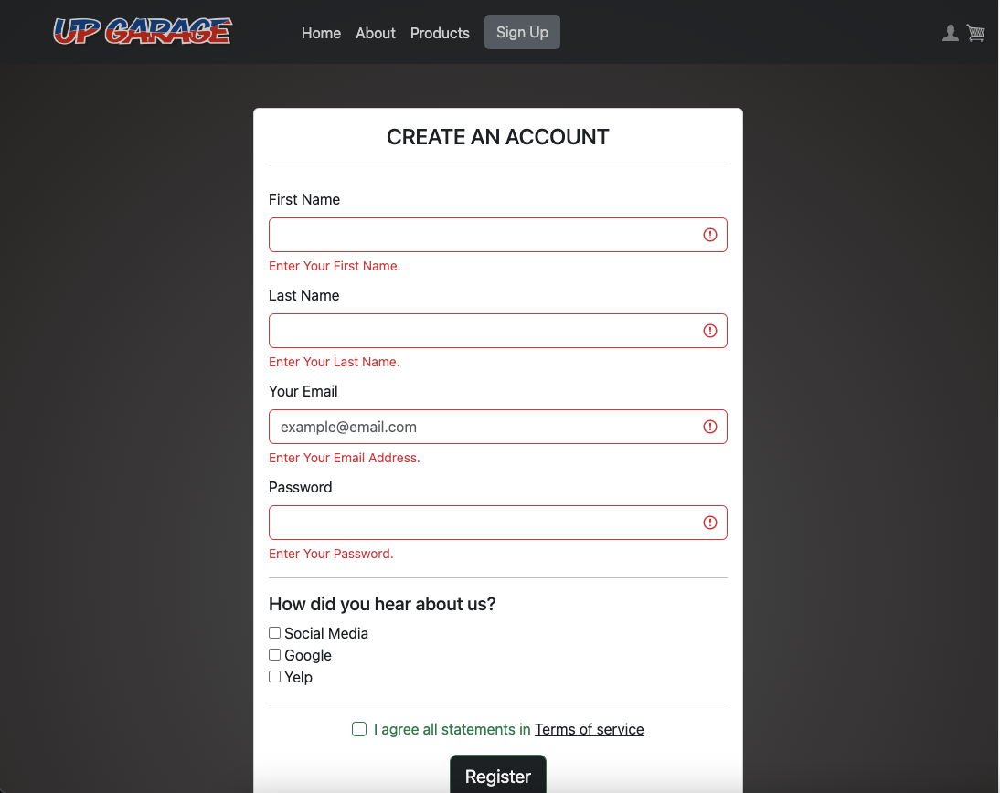
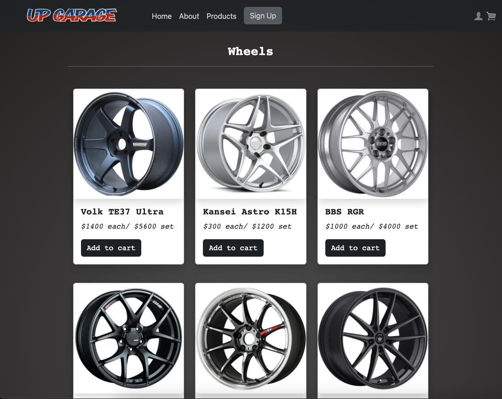
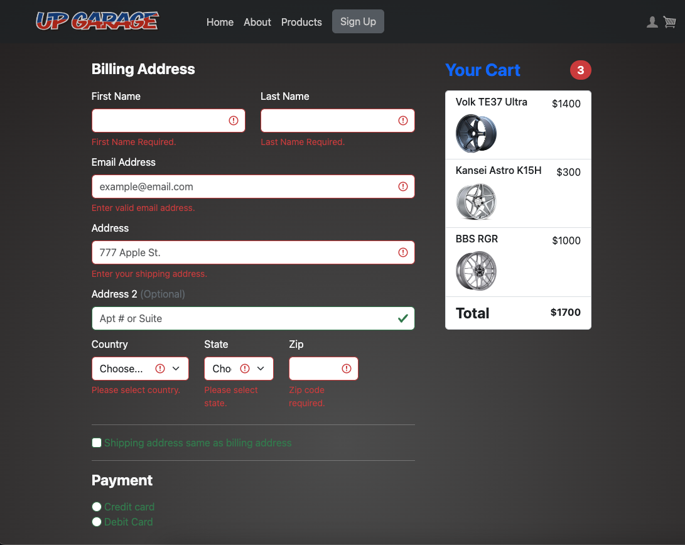

# UPGarage Website
A project website to target customers who are looking to purchase quality car parts. The store only consist of wheels but more to come! User-friendly interface experience with responsiveness depending on device being viewed on. 

Created with HTML, CSS, Bootstrap.

# Project Preview

### Homepage

### User Login

### Sign Up

### Products

### Checkout

## Built With

* [HTML](https://developer.mozilla.org/en-US/docs/Web/HTML)
* [CSS](https://developer.mozilla.org/en-US/docs/Web/CSS)
* [Javascript](https://developer.mozilla.org/en-US/docs/Web/JavaScript)
* [Bootstrap](https://getbootstrap.com/docs/5.3/getting-started/introduction)

## Authors

Michael Nguyen

- [Link to Portfolio Site](#)
- [Link to Github](https://github.com/MichaelNguyenTT)

## License

This project is licensed under the MIT License 

